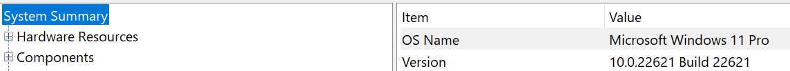
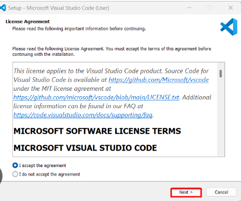
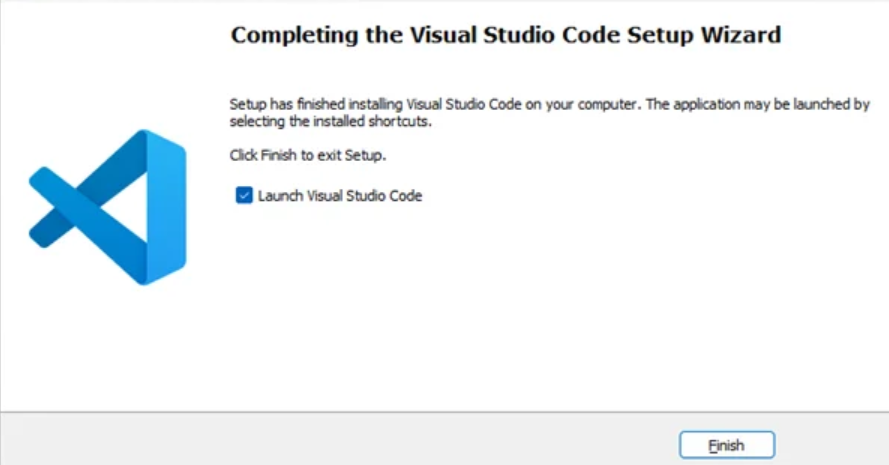
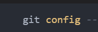
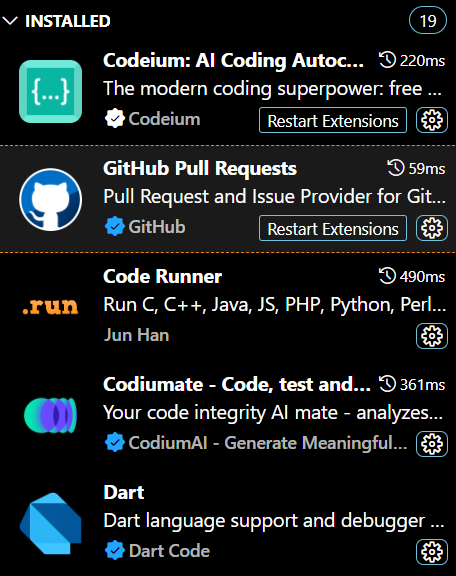
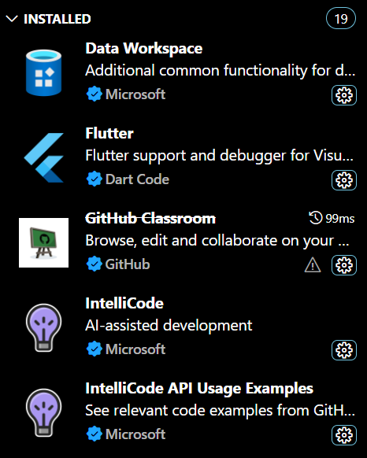
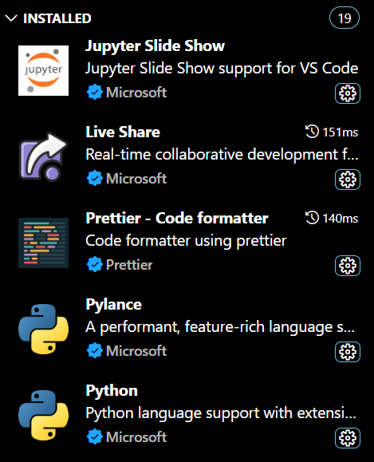

# Dev_Setup
Setup Development Environment

#Assignment: Setting Up Your Developer Environment

#Objective:
This assignment aims to familiarize you with the tools and configurations necessary to set up an efficient developer environment for software engineering projects. Completing this assignment will give you the skills required to set up a robust and productive workspace conducive to coding, debugging, version control, and collaboration.

#Tasks:

1. Select Your Operating System (OS):
   Choose an operating system that best suits your preferences and project requirements. Download and Install Windows 11. https://www.microsoft.com/software-download/windows11
My computer is currently running on Windows 11

2. Install a Text Editor or Integrated Development Environment (IDE):
   Select and install a text editor or IDE suitable for your programming languages and workflow. Download and Install Visual Studio Code. https://code.visualstudio.com/Download
I decided to use VS Code as my text editor. After the download on the website, I clicked on the run button. Read through the terms and conditions and ticked "I agree" and proceeded to next.

Created desktop icon. Selected to let code files "Open with Code" action. This adds an option to open files and folders directly in VS Code from the right-click menu.
Register Code as an editor for supported file types: This makes VS Code the default editor for certain file types.
Added app to PATH which allows one to open VS Code from the command line. Then selected "next".
Displayed settings for checking then selected "Install".
Once the installation was complete, a final setup window appears. I selected to launch VS Code immediately by checking the box that said "Launch Visual Studio Code". Clicked Finish to complete the installation. 
VS Code opens up and ready to use.

3. Set Up Version Control System:
   Install Git and configure it on your local machine. Create a GitHub account for hosting your repositories. Initialize a Git repository for your project and make your first commit. https://github.com
Once Git is downloaded, locate the downloaded .exe file and double-click to run the installer.
Follow the installation prompts. Select Components: Ensure "Git Bash Here" and "Git GUI Here" are selected for easier access. Adjust PATH environment: Choose "Git from the command line and also from 3rd-party software." Choosing HTTPS transport backend: Use the OpenSSL library.
Click "Install" and wait for the installation to complete. Click "Finish" to exit the installer.
Open Git Bash - Right-click on desktop or in any folder and select "Git Bash Here" to open the Git Bash terminal. Set Username and Email - Configure your username and email address, which will be associated with your Git commits. Register and activate account on GitHub then sync on VS Code. To avoid entering your credentials repeatedly, we cache them.

4. Install Necessary Programming Languages and Runtimes:
  Instal Python from http://wwww.python.org programming language required for your project and install their respective compilers, interpreters, or runtimes. Ensure you have the necessary tools to build and execute your code.
Downloaded 64-bit Python version compatible to my laptop. Once the installer is downloaded, double-click on the downloaded file to start the installation process. Check the box that says "Add Python 3.x to PATH" during the installation. This makes it easier to run Python from the command prompt.You can customize the installation by clicking on the "Customize installation" button. Here you can choose the features you want to install. Click on the "Install Now" button to start the installation. Open the Command Prompt by pressing Win + R, typing cmd, and pressing Enter. In the Command Prompt, type python --version. You should see the version number of Python you installed. You can now start writing Python code in VS Code and run it using the Python interpreter.

5. Install Package Managers:
   If applicable, install package managers like pip (Python).
There was no need for me to install the pip - it was installed with Python.

6. Configure a Database (MySQL):
   Download and install MySQL database. https://dev.mysql.com/downloads/windows/installer/5.7.html
Once I downloaded MySQL, run installation setup. Prompted to choose a setup type: Developer Default, Server only, Client only, Full, or Custom. I selected Custom. 
Select the setup type which I chose Developer as a Default. Click Next, the installer is downloaded and installed the necessary components. After the installation, the MySQL Installer started the MySQL Configuration Wizard. Server Configuration Type (Development Machine, Server Machine, Dedicated MySQL Server Machine).
Connectivity (Port Number, allowing TCP/IP connections).
Authentication Method (use Legacy Authentication or Strong Password Encryption). I set my root paasword.
Root Password: Set the root password for MySQL.
User Accounts: Optionally create additional user accounts.
Windows Service - I chose to run MySQL as a Windows service and to should start automatically.

7. Set Up Development Environments and Virtualization (Optional):
   Consider using virtualization tools like Docker or virtual machines to isolate project dependencies and ensure consistent environments across different machines.
I didn't install Docker.

8. Explore Extensions and Plugins:
   Explore available extensions, plugins, and add-ons for your chosen text editor or IDE to enhance functionality, such as syntax highlighting, linting, code formatting, and version control integration.
I installed the following extensions / plugins on my platform - Dart, Flutter, Codium, Prettier, Python, Intellicode, Jupyter, Code Runner and Github Runner.
  

9. Document Your Setup:
    Create a comprehensive document outlining the steps you've taken to set up your developer environment. Include any configurations, customizations, or troubleshooting steps encountered during the process. 
The only problem I came across was with MySQL with the installation not running all the setup and had to run MySQL Workbench separately. I ended up uninstalling the whole app and starting installation from scratch where I chose custom setup which then ran the installation successfully. When I got another error, it was because I hadn't custom opened the PATH in the "Environment Variables". I aligned that and all worked out smoothly.

#Deliverables:
- Document detailing the setup process with step-by-step instructions and screenshots where necessary.
- A GitHub repository containing a sample project initialized with Git and any necessary configuration files (e.g., .gitignore).
- A reflection on the challenges faced during setup and strategies employed to overcome them.

#Submission:
Submit your document and GitHub repository link through the designated platform or email to the instructor by the specified deadline.

#Evaluation Criteria:**
- Completeness and accuracy of setup documentation.
- Effectiveness of version control implementation.
- Appropriateness of tools selected for the project requirements.
- Clarity of reflection on challenges and solutions encountered.
- Adherence to submission guidelines and deadlines.

Note: Feel free to reach out for clarification or assistance with any aspect of the assignment.
